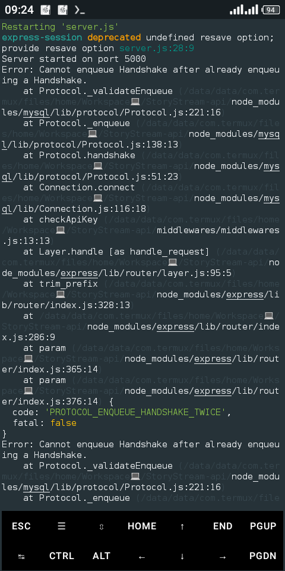

# StoryStream-api
> An API you can get short and interesting stories from

### Tech Stack: MEN(Mysql, ExpressJs, NodeJs)

### Note:
###### Make sure you have XAMP or WAMP or any other mysql administrators installed and configured on your PC, if you're using a mobile phone like i am, download ksweb server, also the database setup file is located in the dbSetupFile folder

To run the project, first you've got to clone the git repo
```sh
$ git clone https://github.com/Dannys-notepad/StoryStream-api
```
Before starting the server run the following command to install all needed dependecies
```sh
$ npm install
```

The project contains a `..env.example` file, it shows you how your .env file contents are to look like, fill each values in their respective fields fields, also the APIKEY field is the super user's apikey, you can use your desired apikey, also to know all super user routes take at the server.js file, the section commented super user routes

To start the server run
```sh
$ npm run dev
```
You will get a deprecation warning, but just ignore it

Below is a screenshot of the active server


### Note:
When you send a request to the Server, you'll get this error message logged on the console as shown Below, but no worries it doesn't affect the flow of the program, I'm working on making it stop though




To get the documentation of the API visit the documentation page, its still in development though

Star the repo if you find the project interesting

## License

MIT

